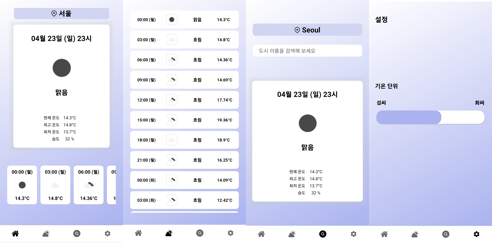
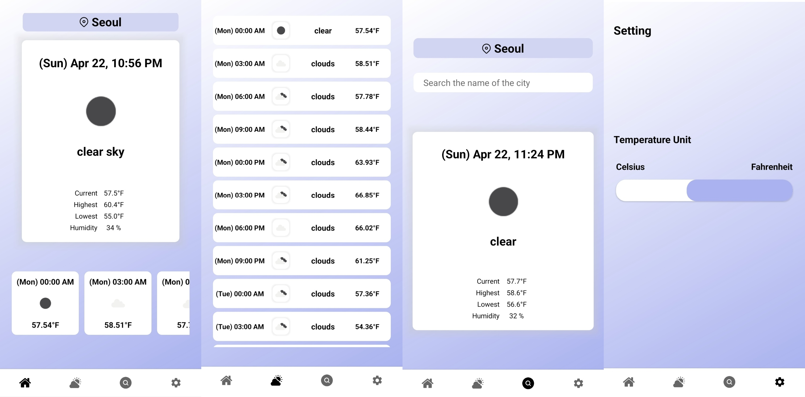
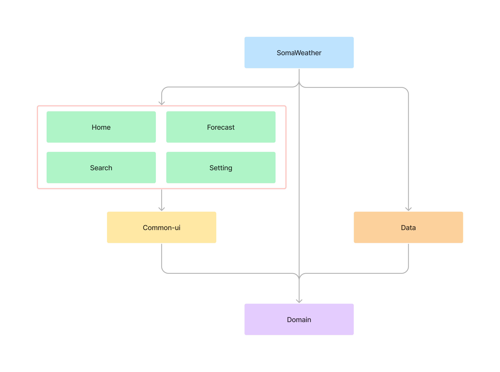
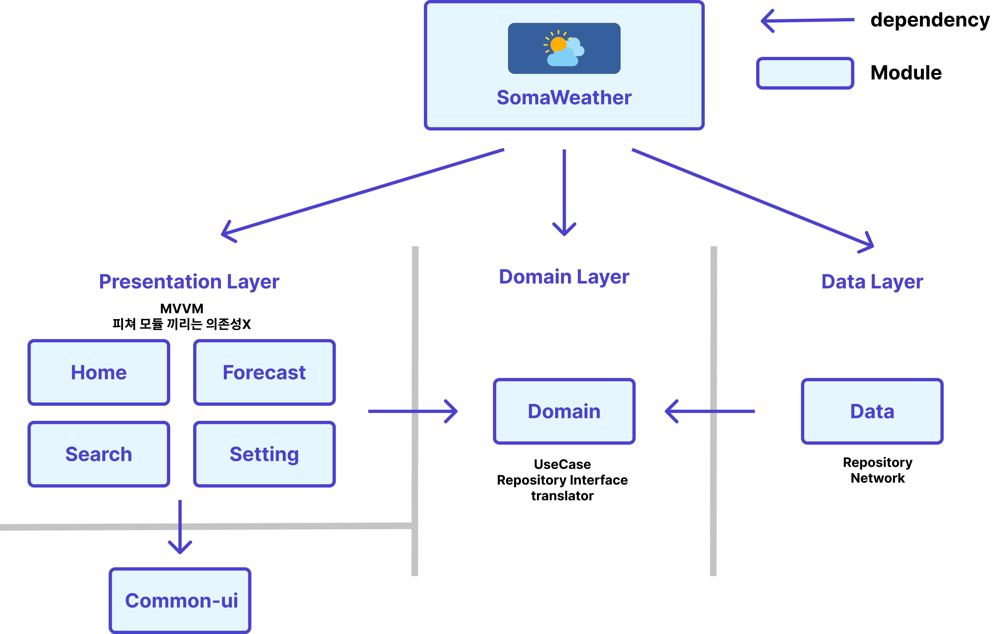

## Soma WeatherApp

**한국어**


**영어**



 - SW 마에스트로 13기에서, Best Practice 용도로 만든 날씨 앱

- 모듈화, 클린 아키텍처

***
### 프로젝트 빌드 방법

현재 Weather API를 사용할 때 필요한 key를 local.properties를 통해 처리했기 때문에 추가하셔야 합니다.

1. [Weather API](https://openweathermap.org/api) 링크로 들어가서 회원가입 후 키를 발급 받습니다.

2. local.properties에서 WEATHER_API_KEY를 생성하여 apikey를 입력해주시면 됩니다.
```
WEATHER_API_KEY = <<API KEY 입력>>
```
3. Android Studio를 Build를 해주시면 BuildConfig에 API_KEY가 생성된 것을 확인하실 수 있습니다.
4. 생성된 것까지 확인하셨다면 실행가능합니다 :)

***
### 모듈 구조

<p align="center"></p>

- **SomaWeather (앱 모듈)**
  - Application, MainActivity (SAA 구조)

- **Domain (도메인 모듈)** 
  - 클린아키텍처 기반 순수 Java/Kotlin 모듈입니다.
  - 비즈니스 모델(VO 등), UseCase, translator
  - repository, DomainMapper, WeatherDataStore와 같은 interface

- **Data (데이터 모듈)** 
  - DataSource, DataStore, Network, Repository, Dispatcher
  - 서버에서 제공되는 데이터(DTO, Response)
  - 비즈니스 모델로 변환하는 mapper

- **Home (홈 모듈)**
  - HomeFragment, HomeViewModel (현재 날씨 및 5일치 날씨 예보)

- **Forecast (일기 예보 모듈)** 
  - ForecastFragment, ForecastViewModel (5일치 일기 예보)

- **Search (도시 검색 모듈)** 
  - SearchFragment, SearchViewModel (도시 이름 검색 - 날씨 정보)
  
- **Setting (기온 단위 설정 모듈)**
  - SettingFragment, SettingViewModel (기온 단위 설정)

- **CommonUI**
  - 피쳐에서 공통적으로 사용할 UI
    - ForeCast 관련 구현파일 (여러 화면에서 사용)
    - BindingAdapters
    - BaseFragment

***

### 아키텍처



> **모듈화**

- 비슷한 책임을 갖는 코드끼리 묶어 모듈로 나누었습니다.
- 모듈화를 해서 모듈끼리의 의존 관계를 설정하고, 코드의 결합도를 낮추고, 응집도를 높입니다. 이로 인해 프로젝트의 유지 보수성이 좋아집니다.
- 모듈 별로 책임이 다르기 때문에 다른 사람이 봤을 때 이런 코드가 이런 모듈 안에 들어갈 것 같다고 예측을 할 수 있습니다. 코드 가독성과 개발 효율이 높아집니다.
- 의존성 없이 잘 만들어 놓은 모듈은 다른 프로젝트에서도 재활용할 수 있습니다.
- 멀티 모듈구조의 경우 빌드 속도가 기존 구조에 비해 빌드 속도를 단축시킬 수 있습니다.

<p align="center"></p>

> **클린 아키텍처**

- Data Layer : 백엔드 or 로컬 데이터로부터 데이터를 가져오는 책임을 갖습니다. Repository 를 갖습니다.
- Domain Layer : 앱의 비즈니스 로직을 담당합니다. UseCase, VO (Value Object), Repository Interface 를 갖습니다.
- Presentaion Layer : UI 로직 관련 책임을 갖습니다. MVVM 패턴을 활용했습니다.

***

### 사용 라이브러리
- **Hilt** : DI
- **Coroutine, Flow** : 비동기 처리
- **Retrofit, OkHttp, Sandwich** : Network
- **Glide** : 이미지 처리
- **Gson**: JSON Parser
- **DataStore**: Local DB